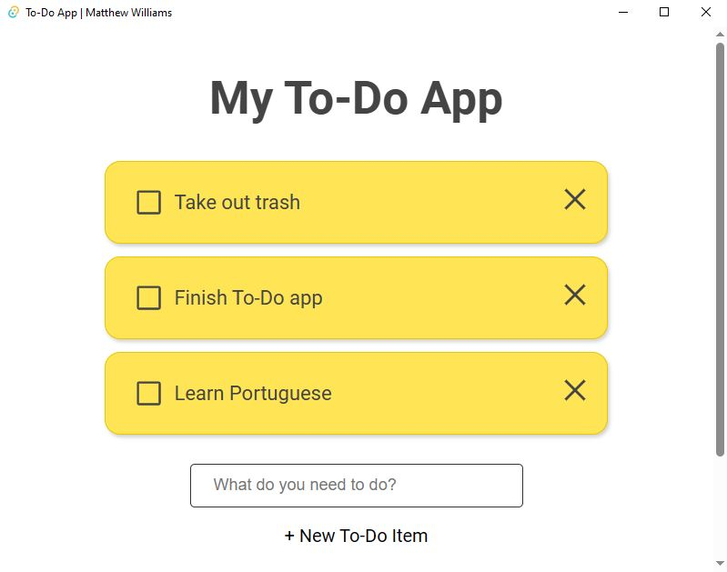

# About the Project

This is a proof-of-concept app built to demonstrate the use of a completely separate application integrated into a Tauri app as an alternate Back-End via the separate application acting as a local WebSocket server.

In this application specifically, the tech stack is as follows:

- Vite + React + Typescript for the Front-End
- Tauri for the native Back-End and application startup
- Java Spring Boot WebSocket Server as the alternate Back-End

## Why in the world would you do this?

I know what you're saying - "Just use Rust for the back end!".  However, I have a particularly large personal project I am ready to start on, and that is not the time to be learning a language like Rust.  I need a language that I know I can write clean, idiomatic code in at a good pace.  So, I wanted to use Java for my back end.

However, there are many situations far different from mine where you may want to integrate some kind of additional application - 3rd party or internal - to augment your Tauri app.  So, this repo is somewhat of a template for the things you need to do to get this to work.

## How is it done?

First, I'll give the general idea of how to integrate the non-Tauri application (I'll just refer to this other app as the "other" app), and then I'll point out all the locations in the code to go look to see what is being done.

### General Idea

The java directory holds the Spring Boot application (this is a mono-repo).  It contains the built JAR to run the server.  The idea is that we want to start the app when we start up, and close it when we close down.  That way, the other app is available when we are running, but doesn't keep running when we close.  Since Spring takes a second to start up, this does mean a second or two at the start of the application where it cannot talk to the server, so your app should be ready for that.  You may also choose to implement some kind of loading screen until the other app can be communicated with.

As for handling the JAR itself, referencing the JAR directly where it gets built (./java/target/) works just fine.  But once the app is built and ran, the app no longer has the permissions it needs to run code from the resources folder (for security reasons).  So, the lib.rs file contains code to move the JAR into the app data directory for the machine, and then runs the JAR from there.  Since this is more of a toy application than anything else, no version checking, stale JAR cleanup, or anything like that is happening.  It just takes the most recent JAR built, moves it to the folder, and runs it.  In a real application you would want to make sure the executable for your "other" app is kept up to date and that old versions are cleaned up.

The front end of this application subscribes to a number of different channels that the server uses to trigger things to happen in the app.  Since it is such a simple app, this could all be handled by a single channel that tells the UI to update the entire list of items to match what the server has.  To demonstrate using another channel, I utilized a newItem channel for when the user chooses to add an item.  It is more to show how multiple channels would work together rather than something the app's requirements drove.

### Details

So, in [Tauri's lib.rs file](./src-tauri/build.rs), we kick off the Spring Boot application via Command::new().spawn().

I had a hard time getting the other application to actually close (even using things like child.kill()), so I chose to listen for the close-requested event in my front-end code in the [/src/components/TauriWindowEventListener.tsx](./src/components/TauriWindowEventListener.tsx) file.  All this component does is listen for the event, and fire a message to the other application (in this case, the Spring Boot app).

On the Java end, the WebSocket server needed to be ready to receive a call to close down.  So in [The Server's Controller](./java/src/main/java/com/matt/myTodoAppJavaSide/controller/TodoAppController.java), I have an endpoint set up starting on line 57 that listens for that call.

## Things to Keep in Mind

There are a number of considerations for larger applications that do not get addressed here (since it's such a small proof-of-concept app).

One of these is that the user may not have the dependencies to run your other application. In my case, I would need to make sure my users had Java installed, and provide some way to prompt them to install it if they didn't have it.  Your requirements here will be different depending on the technology you are using.

Another concern is for applications that must be compiled to specific platforms.  You will need to modify the lib.rs code to run the appropriate build of the application depending on what platform your user is running your Tauri app on.

Also, the sane default for connection timeout on the Java end doesn't really apply well to this situation.  By default, it waits something like 20 seconds to close stale connections.  This causes problems when the user closes and then re-opens the app.  When the server is still waiting 20 seconds for a stale connection to end, the new server can't start up because of the port conflict, and it breaks things.  So in my Java app, I retuned the timeout to be just 2 seconds.  In your "other" application, keep things like that in mind; this situation is very different from the situations they were designed to be defaults for.

## Conclusion

Thanks for reading about this app I built to demonstrate how to integrate other applications with your Tauri app!  If you see things in my repo that are particularly bad practice (namely with the handling of my Java app in the Tauri side or things like that), feel free to reach out to me via email; I would love your feedback and suggestions!

As a side note, if you run the app and then want to delete it from your machine when you're done with it, the app creates a directory in your app data directory (See tauri docs for where app data goes on your OS; on Windows, it's the /Appdata/Roaming directory).  This folder is called "com.matt.dev".  It just has the JAR in there which is small, but I imagine you don't want random stuff left on your machine.  So make sure to go delete that.